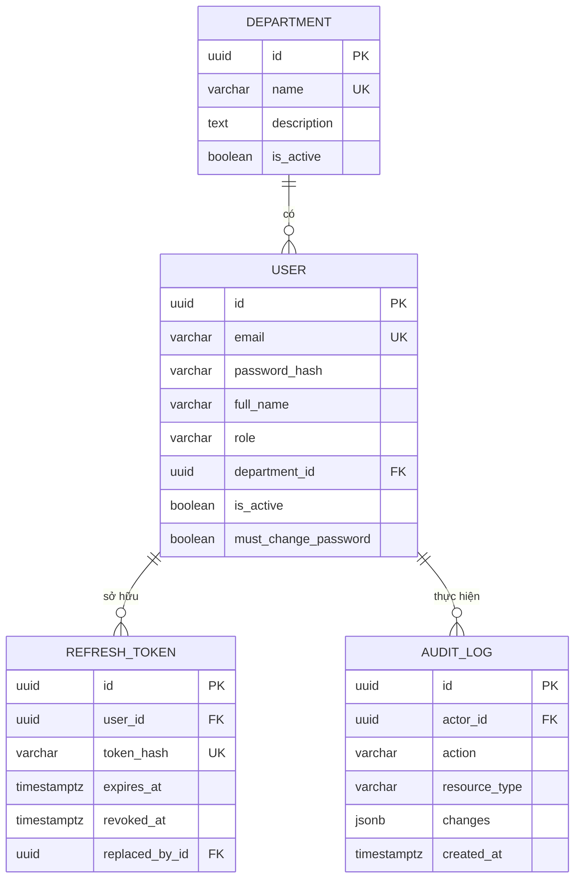

# OmniChat #0 — Foundation: Thiết kế

**Ngày:** 2026-07-21
**Trạng thái:** Đã duyệt thiết kế, chờ lập kế hoạch triển khai
**Sub-project:** #0 trong [roadmap](2026-07-21-omnichat-roadmap.md)

## Mục tiêu

Xây nền tảng kỹ thuật cho toàn bộ hệ thống OmniChat: cấu trúc clean architecture, cơ sở dữ
liệu, xác thực, phân quyền, và quản lý người dùng/phòng ban. Năm sub-project còn lại đều cắm
vào nền tảng này.

Foundation không chứa bất kỳ nghiệp vụ nào về tin nhắn, từ khoá, ca làm việc hay báo cáo.

## Tiêu chí thành công

1. Admin đăng nhập được, tạo được phòng ban, tạo được tài khoản Manager và Staff.
2. Manager chỉ truy cập được dữ liệu nhân viên trong phòng ban của mình.
3. Staff không truy cập được bất kỳ endpoint quản trị nào.
4. Mọi thao tác thay đổi người dùng đều để lại bản ghi audit.
5. `import-linter` xác nhận dependency rule không bị vi phạm.
6. Test ba tầng chạy xanh trong CI.

---

## 1. Kiến trúc

### 1.1 Nguyên tắc tổ chức

Clean Architecture tổ chức theo **module dọc**: chia theo nghiệp vụ trước, layer sau. Mỗi
sub-project trong roadmap tương ứng một thư mục dưới `modules/`, nên thêm module mới không
đụng vào code cũ.

Phương án thay thế đã cân nhắc và loại bỏ:

- **Layer ngang** (`domain/entities/` chứa entity của mọi module): đúng sách giáo khoa hơn
  nhưng với sáu subsystem thì thư mục entity sẽ trộn lẫn nghiệp vụ, ranh giới module biến mất.
- **Modular monolith nghiêm ngặt** (module giao tiếp qua `public_api` + event bus): ranh giới
  cứng nhất, nhưng chi phí event bus và eventual consistency chưa cần thiết ở giai đoạn này.
  Nâng cấp từ module dọc lên phương án này sau không phải viết lại.

### 1.2 Cấu trúc thư mục

```
backend/
├── src/
│   ├── shared/
│   │   ├── domain/
│   │   │   ├── entity.py           # Entity base, AggregateRoot
│   │   │   ├── value_object.py     # ValueObject base (frozen dataclass)
│   │   │   └── exceptions.py       # DomainError, BusinessRuleViolationError
│   │   ├── application/
│   │   │   ├── use_case.py         # UseCase[TInput, TOutput]
│   │   │   ├── unit_of_work.py     # UnitOfWork interface
│   │   │   └── exceptions.py       # NotFoundError, PermissionDeniedError
│   │   └── infrastructure/
│   │       ├── database.py         # engine, session factory, Base
│   │       ├── config.py           # Settings (pydantic-settings)
│   │       ├── logging.py          # structured logging + request_id
│   │       └── sqlalchemy_uow.py   # UnitOfWork implementation
│   ├── modules/
│   │   └── identity/
│   │       ├── domain/
│   │       │   ├── entities/       # user.py, department.py
│   │       │   ├── value_objects/  # email.py, password_hash.py, role.py
│   │       │   ├── repositories/   # IUserRepository, IDepartmentRepository
│   │       │   └── services/
│   │       ├── application/
│   │       │   ├── use_cases/      # một file một use case
│   │       │   ├── dto/
│   │       │   └── ports/          # IPasswordHasher, ITokenService, IClock
│   │       ├── infrastructure/
│   │       │   ├── models/         # SQLAlchemy ORM model
│   │       │   ├── repositories/   # implementation
│   │       │   ├── security/       # BcryptHasher, JwtTokenService
│   │       │   └── mappers/        # ORM model ↔ domain entity
│   │       └── presentation/
│   │           ├── routers/
│   │           ├── schemas/        # Pydantic request/response
│   │           └── dependencies.py # DI wiring, get_current_user
│   └── main.py                     # composition root
├── migrations/                     # Alembic
├── tests/
│   ├── unit/
│   ├── integration/
│   └── e2e/
├── pyproject.toml
├── docker-compose.yml              # PostgreSQL cho môi trường dev
└── Dockerfile
```

### 1.3 Dependency Rule

```
presentation ──→ application ──→ domain
                      ↑              ↑
                      └── infrastructure ──┘
```

- `domain/` chỉ import stdlib. Không SQLAlchemy, không FastAPI, không Pydantic.
- `application/` chỉ import `domain`, và định nghĩa port cho thứ nó cần từ bên ngoài.
- `infrastructure/` implement interface của `domain` và `application`.
- `presentation/` gọi use case; không import `infrastructure` trực tiếp mà đi qua
  `dependencies.py`.

Quy tắc này được kiểm tra tự động bằng `import-linter` trong CI. Không dựa vào kỷ luật thủ công:
đây là cơ chế duy nhất giữ cho kiến trúc không bị xói mòn theo thời gian.

### 1.4 Tách ORM model khỏi domain entity

Domain entity là dataclass thuần Python chứa business logic. SQLAlchemy model chỉ mô tả bảng.
Mapper chuyển đổi hai chiều.

Đây là điểm thường bị làm sai: nếu SQLAlchemy model đồng thời là domain entity thì `domain`
phụ thuộc vào cơ sở dữ liệu và dependency rule bị phá vỡ.

**Chi phí đã chấp nhận:** mỗi entity tốn thêm khoảng 40 dòng mapper và phải cập nhật mapper khi
thêm field. Đổi lại, unit test domain chạy không cần cơ sở dữ liệu.

---

## 2. Domain Model

### 2.1 Department

| Field | Kiểu | Ghi chú |
|---|---|---|
| `id` | UUID | khoá chính |
| `name` | str | duy nhất trong các phòng đang active |
| `description` | str? | |
| `is_active` | bool | soft delete |
| `created_at` / `updated_at` | timestamptz | |

Danh sách phẳng, không có phân cấp phòng cha/phòng con.

**Business rules:**
- Không được vô hiệu hoá phòng ban còn nhân viên đang active.
- Tên phòng ban duy nhất trong các phòng đang active.

### 2.2 User

Ba vai trò dùng chung một bảng.

| Field | Kiểu | Ghi chú |
|---|---|---|
| `id` | UUID | khoá chính |
| `email` | Email (value object) | duy nhất toàn bảng, dùng để đăng nhập |
| `password_hash` | PasswordHash (value object) | bcrypt |
| `full_name` | str | |
| `phone` | str? | |
| `role` | Role (enum value object) | `STAFF` \| `MANAGER` \| `ADMIN` |
| `department_id` | UUID? | nullable — Admin không thuộc phòng ban nào |
| `is_active` | bool | soft delete |
| `must_change_password` | bool | true khi Admin vừa cấp tài khoản hoặc reset mật khẩu |
| `last_login_at` | timestamptz? | |
| `created_at` / `updated_at` | timestamptz | |

**Business rules** (đặt trong domain entity, không đặt ở router):
- `STAFF` và `MANAGER` bắt buộc có `department_id`; `ADMIN` bắt buộc không có.
- Một phòng ban có tối đa một Manager đang active.
- Không thể vô hiệu hoá Admin cuối cùng còn active trong hệ thống.
- Khi đổi role Staff → Manager: từ chối nếu phòng ban đã có Manager active.
- Khi kích hoạt lại một user có role `MANAGER`: từ chối nếu phòng ban của họ đã có Manager
  active khác. Admin phải đổi role hoặc đổi phòng ban trước khi kích hoạt lại.
- Khi kích hoạt lại bất kỳ user nào: từ chối nếu phòng ban của họ đã bị vô hiệu hoá.

Email là duy nhất vĩnh viễn trên toàn bảng, kể cả với user đã bị vô hiệu hoá. Nếu nhân viên
quay lại làm việc thì Admin kích hoạt lại tài khoản cũ thay vì tạo tài khoản mới. Lựa chọn này
giữ cho audit log không có hai danh tính trùng email.

### 2.3 RefreshToken

| Field | Kiểu | Ghi chú |
|---|---|---|
| `id` | UUID | khoá chính |
| `user_id` | UUID | khoá ngoại → users |
| `token_hash` | str | lưu SHA-256 hash, không lưu token thô |
| `expires_at` | timestamptz | |
| `revoked_at` | timestamptz? | null nghĩa là còn hiệu lực |
| `replaced_by_id` | UUID? | phục vụ rotation và phát hiện tái sử dụng |
| `user_agent` / `ip_address` | str? | truy vết phiên |
| `created_at` | timestamptz | |

### 2.4 AuditLog

| Field | Kiểu | Ghi chú |
|---|---|---|
| `id` | UUID | khoá chính |
| `actor_id` | UUID? | null nếu do hệ thống thực hiện |
| `action` | str | ví dụ `user.created`, `user.role_changed`, `auth.login_failed` |
| `resource_type` / `resource_id` | str / str? | |
| `changes` | JSONB? | trạng thái trước/sau |
| `ip_address` / `user_agent` | str? | |
| `created_at` | timestamptz | append-only |

### 2.5 Sơ đồ quan hệ



### 2.6 Quyết định ở tầng cơ sở dữ liệu

**UUID v7 làm khoá chính**, không dùng v4. UUID v7 sắp xếp được theo thời gian nên index B-tree
không bị phân mảnh khi ghi nhiều — điều này quan trọng cho bảng messages ở sub-project #1.

**`timestamptz` cho mọi mốc thời gian**, lưu UTC, quy đổi múi giờ ở tầng presentation. Cần
thiết vì #4 HRM sẽ xử lý ca làm việc.

**Partial unique index** đảm bảo mỗi phòng ban tối đa một Manager active:

```sql
CREATE UNIQUE INDEX uq_department_active_manager
  ON users(department_id)
  WHERE role = 'MANAGER' AND is_active;
```

Ràng buộc này nằm ở cơ sở dữ liệu chứ không chỉ ở code. Business rule tầng domain có thể bị
race condition khi hai request đồng thời; chỉ ràng buộc DB mới chắc chắn.

**Unique index toàn bảng cho email**, không dùng partial index:

```sql
CREATE UNIQUE INDEX uq_user_email ON users(lower(email));
```

Index trên `lower(email)` để so sánh không phân biệt hoa thường. Ràng buộc áp dụng cho cả user
đã bị vô hiệu hoá, đúng với quyết định "email duy nhất vĩnh viễn" ở mục 2.2.

**`role` lưu dạng VARCHAR kèm CHECK constraint**, không dùng kiểu ENUM của PostgreSQL. Thêm
role mới bằng ENUM cần `ALTER TYPE`, phiền phức khi migrate.

---

## 3. Use Cases

### 3.1 Nhóm Auth

| Use case | Quyền truy cập |
|---|---|
| `LoginUser` | công khai |
| `RefreshAccessToken` | công khai |
| `LogoutUser` | đã đăng nhập |
| `ChangePassword` | đã đăng nhập, đổi mật khẩu của chính mình |
| `GetCurrentUser` | đã đăng nhập |

### 3.2 Nhóm User

| Use case | Quyền truy cập |
|---|---|
| `CreateUser` | Admin |
| `UpdateUser` | Admin (mọi user) / Manager (chỉ Staff phòng mình, chỉ field hồ sơ) |
| `DeactivateUser` | Admin |
| `ReactivateUser` | Admin |
| `ChangeUserRole` | Admin — chuyển đổi Staff ↔ Manager |
| `AssignUserToDepartment` | Admin |
| `ResetUserPassword` | Admin — cấp mật khẩu tạm, bật `must_change_password` |
| `ListUsers` | Admin (tất cả) / Manager (chỉ phòng mình) |
| `GetUser` | Admin / Manager (phòng mình) / chính chủ |

### 3.3 Nhóm Department

`CreateDepartment`, `UpdateDepartment`, `DeactivateDepartment`, `ListDepartments`,
`GetDepartment` — thao tác ghi chỉ dành cho Admin.

### 3.4 Nhóm Audit

`ListAuditLogs` — chỉ Admin, lọc được theo actor, action và khoảng thời gian.

---

## 4. API Contract

```
POST   /api/v1/auth/login                    công khai
POST   /api/v1/auth/refresh                  công khai
POST   /api/v1/auth/logout                   authenticated
POST   /api/v1/auth/change-password          authenticated
GET    /api/v1/auth/me                       authenticated

GET    /api/v1/users                         Admin | Manager (phòng mình)
POST   /api/v1/users                         Admin
GET    /api/v1/users/{id}                    Admin | Manager (phòng mình) | chính chủ
PATCH  /api/v1/users/{id}                    Admin | Manager (hồ sơ, phòng mình)
POST   /api/v1/users/{id}/deactivate         Admin
POST   /api/v1/users/{id}/reactivate         Admin
PATCH  /api/v1/users/{id}/role               Admin
PATCH  /api/v1/users/{id}/department         Admin
POST   /api/v1/users/{id}/reset-password     Admin

GET    /api/v1/departments                   authenticated
POST   /api/v1/departments                   Admin
GET    /api/v1/departments/{id}              authenticated
PATCH  /api/v1/departments/{id}              Admin
POST   /api/v1/departments/{id}/deactivate   Admin

GET    /api/v1/audit-logs                    Admin

GET    /health                               công khai — liveness
GET    /health/ready                         công khai — readiness, kiểm tra DB
```

Thao tác đổi trạng thái dùng `POST /{id}/{action}` thay vì gộp vào `PATCH`. Lý do:
`ChangeUserRole` có business rule riêng (kiểm tra phòng đã có Manager chưa); gộp vào PATCH
chung sẽ làm use case phình to và khó phân quyền chính xác.

### 4.1 Định dạng lỗi

```json
{
  "error": {
    "code": "USER_EMAIL_ALREADY_EXISTS",
    "message": "Email đã được sử dụng.",
    "details": { "email": "a@b.com" }
  },
  "request_id": "01927f3e-..."
}
```

Exception handler toàn cục ánh xạ: `DomainError` → 422, `NotFoundError` → 404,
`PermissionDeniedError` → 403, `AuthenticationError` → 401.

---

## 5. Phân quyền (RBAC)

Ba tầng kiểm tra, mỗi tầng giải quyết một loại câu hỏi khác nhau:

**Tầng 1 — Route guard** (`presentation/dependencies.py`): kiểm tra role tối thiểu, chặn sớm
với chi phí thấp.

```python
@router.post("/users", dependencies=[Depends(require_role(Role.ADMIN))])
```

**Tầng 2 — Use case**: kiểm tra quyền theo ngữ cảnh dữ liệu. `ListUsers` nhận `requester` và
tự quyết định phạm vi: Admin thấy tất cả, Manager chỉ thấy
`department_id == requester.department_id`. Route guard không biết được điều này.

**Tầng 3 — Domain entity**: business invariant. `User.change_role()` tự từ chối nếu vi phạm
quy tắc, bất kể được gọi từ đâu.

---

## 6. Bảo mật

| Yêu cầu phi chức năng | Cách đáp ứng trong #0 |
|---|---|
| Xác thực & phân quyền bằng JWT | Access token 15 phút (HS256); refresh token 7 ngày có rotation và phát hiện tái sử dụng |
| Mã hoá dữ liệu nhạy cảm | Mật khẩu băm bằng bcrypt cost 12; refresh token lưu dưới dạng SHA-256 hash |
| Chống SQL Injection | SQLAlchemy parameterized query; cấm nối chuỗi SQL thô |
| Chống XSS | API chỉ trả JSON, không render HTML; frontend Next.js escape mặc định; bổ sung security headers |
| HTTPS/TLS | Terminate ở reverse proxy hoặc load balancer của cloud — là yêu cầu triển khai, không phải code ứng dụng |
| Bảo vệ dữ liệu người dùng | RBAC ba tầng, audit log, rate limit trên `/auth/login` |

**Refresh token rotation:** mỗi lần refresh sinh token mới và đánh dấu token cũ đã dùng. Nếu
một token đã dùng bị gửi lại, hệ thống hiểu là token bị đánh cắp và thu hồi toàn bộ chuỗi token
của user đó.

**Rate limit trên login:** giới hạn theo IP và theo email để chống brute force.

**Thu hồi quyền truy cập.** Access token là JWT stateless: server không lưu và không tra cứu nó,
nên sau khi Admin vô hiệu hoá một user, access token đang nằm trong tay họ vẫn hợp lệ về mặt mật
mã cho tới khi hết hạn. Hệ thống xử lý như sau:

- Refresh token của user bị thu hồi **ngay lập tức** khi vô hiệu hoá.
- Access token hết hiệu lực sau **tối đa 15 phút**, khi hết hạn tự nhiên.

Nghĩa là tồn tại cửa sổ tối đa 15 phút trong đó user vừa bị vô hiệu hoá vẫn truy cập được dữ
liệu. Đây là đánh đổi có chủ đích để giữ tính stateless — xem mục 9.

---

## 7. Chiến lược Testing

### 7.1 Kim tự tháp

```
        ╱ e2e ╲          ~10 test  — API + DB thật, luồng chính
      ╱─────────╲
    ╱ integration ╲       ~25 test  — repository + DB thật
  ╱─────────────────╲
╱      unit          ╲    ~60 test  — domain + use case, không I/O
```

### 7.2 Unit test

Kiểm tra business rule trong domain entity, không chạm cơ sở dữ liệu:

- `User.change_role()` từ chối khi phòng đã có Manager active
- `User` có role `ADMIN` mà mang `department_id` → raise
- `User` có role `STAFF` mà thiếu `department_id` → raise
- `Department.deactivate()` từ chối khi còn nhân viên active
- `Email` value object từ chối định dạng sai
- `LoginUser` trả lỗi khi user có `is_active = false`

Use case được test với **fake repository in-memory**, không dùng thư viện mock. Fake phản ánh
hành vi thật; mock chỉ phản ánh giả định của người viết test.

### 7.3 Integration test

Chạy trên PostgreSQL thật:

- Repository lưu và đọc đúng; mapper chuyển đổi hai chiều không mất dữ liệu
- Partial unique index thực sự chặn hai Manager cùng phòng ban
- Unit of Work rollback đúng khi có lỗi
- Alembic migration chạy được cả `upgrade` lẫn `downgrade`

Bắt buộc dùng PostgreSQL thật, không dùng SQLite: SQLite không hỗ trợ partial index, JSONB hay
`timestamptz`, nên test sẽ xanh giả.

### 7.4 E2E test

Qua FastAPI TestClient, theo luồng người dùng thật:

1. Admin đăng nhập → tạo phòng ban → tạo Manager → tạo Staff
2. Staff đăng nhập lần đầu → bị buộc đổi mật khẩu → đổi xong dùng được hệ thống
3. Manager chỉ thấy nhân viên phòng mình, không thấy phòng khác
4. Staff gọi endpoint dành cho Admin → nhận 403
5. Refresh token rotation: dùng lại token cũ → bị từ chối và toàn bộ chuỗi token bị thu hồi
6. Vô hiệu hoá user → refresh token của họ bị thu hồi ngay, không đổi được token mới. Access
   token cũ vẫn dùng được tới khi hết hạn — test khẳng định đúng hành vi này, không khẳng định
   thu hồi tức thì (xem mục 6 và mục 9)
7. Vô hiệu hoá user → không đăng nhập lại được

### 7.5 Quy ước

- Tên test mô tả hành vi, viết tiếng Việt không dấu:
  `test_khong_cho_phep_hai_manager_trong_cung_phong_ban`
- Mỗi test độc lập; cơ sở dữ liệu rollback sau mỗi test qua transaction fixture
- Không dùng `sleep()` trong test
- Mục tiêu coverage: domain và application ≥ 90%, tổng thể ≥ 80%. Không đặt mục tiêu 100% vì
  sẽ dẫn tới test rác cho getter/setter.

### 7.6 CI pipeline

```
ruff (lint) → ruff format --check → mypy (strict cho domain và application)
  → import-linter → pytest unit → pytest integration → pytest e2e
```

---

## 8. Phạm vi

### 8.1 Trong phạm vi #0

- Cấu trúc thư mục clean architecture, `shared/` kernel, module `identity/`
- Docker Compose (PostgreSQL) cho môi trường dev
- Alembic migration
- Auth: login, refresh có rotation, logout, đổi mật khẩu, `/me`
- RBAC ba tầng cho Staff / Manager / Admin
- CRUD User: tạo, sửa, vô hiệu hoá, kích hoạt lại, đổi role, đổi phòng ban, reset mật khẩu
- CRUD Department (danh sách phẳng)
- Audit log append-only và API tra cứu cho Admin
- Rate limit trên `/auth/login`
- Exception handler toàn cục, định dạng lỗi thống nhất, `request_id`
- Health check (liveness và readiness)
- CI: ruff, mypy, import-linter, pytest ba tầng
- Seed script tạo Admin đầu tiên

### 8.2 Ngoài phạm vi #0

- Tin nhắn, hội thoại, kênh, webhook → #1
- WebSocket và realtime → #1
- Từ khoá và phân tích AI → #2
- Ca làm việc, KPI, đơn từ, phê duyệt → #4
- Báo cáo, dashboard, thống kê → #5
- Frontend Next.js → spec riêng sau khi API #0 hoàn tất
- Mobile app → không làm
- Cấu hình cloud cụ thể (Azure hoặc GCP) → chưa quyết, chỉ đóng gói Docker
- Quên mật khẩu qua email, xác thực hai lớp, SSO → không làm. Admin reset mật khẩu hộ là đủ
  cho mô hình "chỉ Admin cấp tài khoản"

---

## 9. Giới hạn đã biết

**Rate limit in-memory không chính xác khi chạy nhiều instance.** Mỗi replica giữ bộ đếm riêng,
nên giới hạn thực tế nhân lên theo số replica. Yêu cầu 1000 người dùng đồng thời gần như chắc
chắn cần nhiều replica, lúc đó phải chuyển bộ đếm sang Redis. Đây là nợ kỹ thuật được ghi nhận
có ý thức, không phải thiếu sót.

**Thu hồi quyền truy cập có độ trễ tối đa 15 phút.** Vô hiệu hoá user thu hồi refresh token ngay,
nhưng access token đang lưu hành vẫn hợp lệ tới khi hết hạn. Hai phương án thay thế đã cân nhắc
và loại bỏ:

- *Kiểm tra `is_active` trong cơ sở dữ liệu ở mỗi request*: thu hồi tức thì, nhưng mất tính
  stateless và thêm một truy vấn cho mọi request. Với mục tiêu 1000 người dùng đồng thời, chi phí
  này đi ngược lại chính yêu cầu hiệu năng của đề bài.
- *Rút access token xuống 5 phút*: thu hẹp cửa sổ rủi ro nhưng làm tần suất gọi refresh tăng gấp
  ba, dồn tải sang endpoint refresh và bảng refresh token.

Rủi ro được chấp nhận vì đây là hệ thống nội bộ doanh nghiệp. Khi cần thu hồi tức thì, giải pháp
là thêm denylist token trên Redis ở giai đoạn scale — cùng lúc với việc chuyển rate limit sang
Redis.

**Chi phí mapper ORM ↔ domain.** Mỗi entity tốn thêm khoảng 40 dòng mapper và phải cập nhật khi
thêm field. Chấp nhận đánh đổi này để giữ dependency rule.

**NFR 1000 người dùng đồng thời chưa được kiểm chứng ở #0.** Foundation không bao gồm load
test. Con số này chỉ có ý nghĩa khi #1 Inbox hoàn tất, vì đó là nơi tải thực sự phát sinh.
Không tuyên bố đã đạt.

**NFR uptime 99,5% và sao lưu/phục hồi phụ thuộc hạ tầng cloud chưa chọn.** Thiết kế giữ ứng
dụng stateless và migration có phiên bản để không cản trở mục tiêu, nhưng không thể đảm bảo con
số khi chưa có nền tảng triển khai.

---

## 10. Bước tiếp theo

Lập kế hoạch triển khai chi tiết cho #0 bằng skill `writing-plans`.
